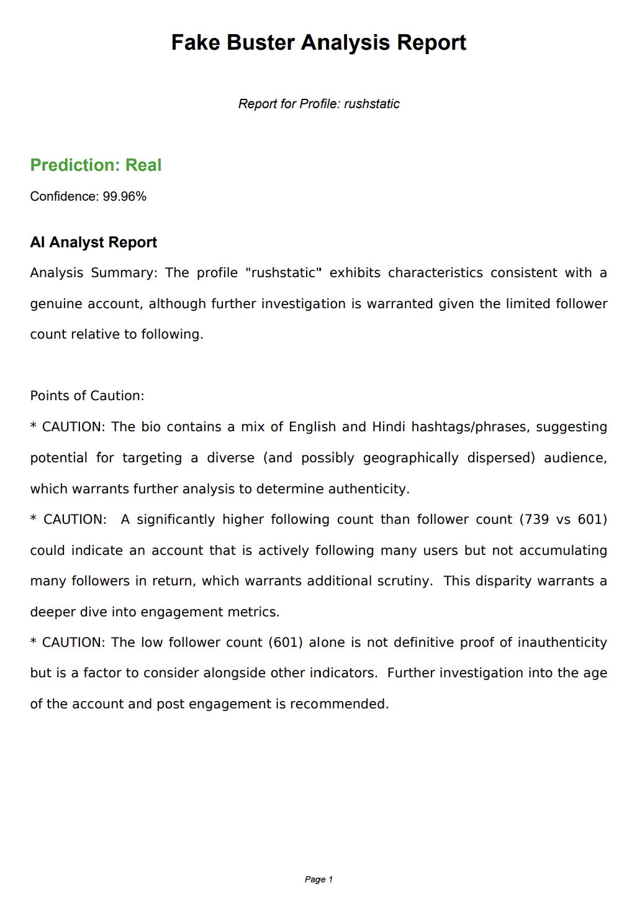

# Fake Buster - AI-Powered Social Media Account Detector

A full-stack application that analyzes public Instagram and X profiles to detect fake accounts and bots in real-time using a custom-trained machine learning model and generative AI.


### Key Features
- **Live Data Analysis**: Scrapes live profile data using a Python backend and the ScrapingDog API.
- **Advanced ML Model**: Utilizes an XGBoost classifier with Natural Language Processing (NLP) to analyze profile statistics and bio text for nuanced detection.
- **Generative AI Reports**: Integrates Google's Gemini API to provide human-like explanations and points of caution for each prediction.
- **Dynamic Frontend**: A responsive, animated, and dark-mode-enabled frontend built with React.
- **Downloadable Reports**: Users can download a full analysis of any profile as a formatted PDF document.


### Application in Action

#### Main Interface
[Main Interface]


#### AI Analyst Report
[AI Analyst Report showing prediction and analysis in Dark and Light mode ]





### PDF Reprt
[User can download their report ]


### Tech Stack
- **Backend**: Python, Flask, Pandas, Scikit-learn, XGBoost, NLTK
- **Frontend**: React, CSS, Framer Motion
- **APIs**: Google Gemini API, ScrapingDog API
- **Tools**: Git, GitHub, VS Code

---

### How to Run Locally

1.  **Backend Setup**
    ```bash
    # Navigate to the root folder
    python -m venv venv
    venv\Scripts\activate
    pip install -r requirements.txt
    python app.py
    ```
2.  **Frontend Setup**
    ```bash
    # Open a new terminal and navigate to the frontend folder
    cd frontend
    npm install
    npm start
    ```
